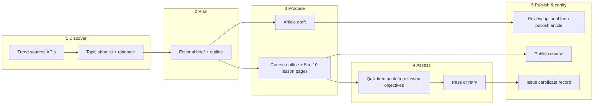

# AI trend discovery → articles & mini-courses (workflow proposal)

**Purpose:** A readable workflow for Xalura Tech: discover trending AI topics, produce articles and short courses with a final quiz, and issue completion certificates. **No implementation code** — design only.

---

## Is this possible?

**Yes**, as an orchestrated system (automations + your APIs + Supabase + optional human review). Nothing here requires magic — it requires **clear data sources**, **guardrails**, and **honest limits** (especially around “search Google” and certificates).

---

## One agent vs multiple agents

| Approach | What it means | Pros | Cons |
|----------|----------------|------|------|
| **Single “orchestrator” agent** | One logical pipeline: plan → research → draft → publish → course → quiz → cert. | Simpler ops, one queue, easier debugging. | One failure mode can block everything; prompts get long; harder to specialize quality per step. |
| **Multiple specialized agents** | e.g. **Scout** (trends) → **Writer** (articles) → **Curriculum** (course outline + pages) → **Examiner** (quiz) → **Publisher** (CMS + email). | Better quality per step, parallel work, clear ownership of failures. | More moving parts, need handoff contracts (JSON between steps). |

**Recommendation:** Start with **one orchestrated workflow** (single queue) but **model it as multiple roles** internally (Scout / Writer / Instructor / Examiner). You can split into separate services or cron jobs later without changing the *conceptual* workflow.

**GearMedic / Xalura fit:** Your existing **agent ingest** (`/api/agent-update`) can receive **status updates per role** or per milestone so the **AI Dashboard** stays the human control plane.

---

## Critical external capabilities (you must choose providers)

### “Search Google for trends”

- **Google does not offer a free “Google Search results as JSON” for arbitrary automation** in the way people imagine. Realistic options:
  - **Google Trends** (official or third-party APIs) — good for *relative* interest over time / regions.
  - **Google Custom Search JSON API** — search *your* configured sites or the programmable web index within quotas — not “the whole web” like google.com in a browser.
  - **News APIs** (e.g. aggregators) — headlines and links for “what’s hot.”
  - **RSS / X / Reddit** — topic feeds (each has ToS and rate limits).

**Workflow implication:** The **Scout** step should output **structured “topic candidates”** (title, why trending, 2–5 source links, confidence), not rely on a single ambiguous “Google scrape.”

### Article & course generation

- Your **LLM / GearMedic API** turns **topic + outline + constraints** into drafts.
- **Human-in-the-loop** (recommended for Xalura brand): **draft → review → publish** for public site; automation can still prepare drafts in admin.

### Mini-exam & certificate

- **Exam:** stored **question bank** per course version, **randomized subset**, **passing score** (e.g. 80%), **max attempts**, **time limit** optional.
- **Certificate:** only issued when **course row** is marked **completed** and **exam passed** in **your** database — e.g. signed PDF URL or verifiable token (short id on certificate that checks Supabase). **“Only completed course by Xalura Tech”** = **only courses authored/published under your tenant** (`courses` table + `course_completions` + `exam_attempts`).

**Anti-abuse:** rate limits, auth for exam, no public answer keys, invalidate cert if course content version bumps (optional policy).

---

## End-to-end workflow (high level)

---

## Role-by-role workflow (conceptual agents)

### Agent A — Scout (trend discovery)

**Inputs:** region, language, “AI” verticals, exclude topics (spam, NSFW), freshness window (e.g. last 7 days).  
**Outputs:** ranked list: `topic_title`, `summary_why_trending`, `suggested_angle`, `source_urls[]`, `risk_flags` (duplicate, low trust).  
**Frequency:** daily or twice daily cron.

### Agent B — Writer (articles)

**Inputs:** one approved topic from Scout (or human pick).  
**Outputs:** title, slug suggestion, excerpt, body (Markdown), suggested tags, internal links to your existing articles.  
**Gate:** optional **human approve** before `is_published` on `articles`.

### Agent C — Curriculum designer (mini-courses)

**Inputs:** same topic or paired article; target length **5–10 “pages”** (lessons).  
**Outputs:** course title, description, ordered **lessons** (each: learning objective, body, optional video placeholder), estimated minutes.  
**Gate:** human approve outline optional; then lessons generated.

### Agent D — Examiner (quiz)

**Inputs:** lesson objectives + key facts (from Curriculum).  
**Outputs:** **N** multiple-choice questions (configurable), correct answers stored **server-side only**, distractors.  
**Rules:** map each question to `lesson_id` for coverage; rotate pools to reduce memorization.

### Agent E — Publisher & certifier

**Inputs:** passed exam + completed lesson progress.  
**Outputs:** `course_completions` row, **certificate artifact** (PDF or image URL), **verification code**.  
**Brand:** “Completed at Xalura Tech” — template with date, course name, learner name (from auth profile).

---

## Data you’d eventually store (conceptual)

- **Trend run:** id, time, raw candidates JSON, chosen topic ids.
- **Articles:** existing `articles` + workflow status if you add drafts.
- **Courses / lessons:** existing `courses`, `lessons` + **version** if content changes.
- **Enrollments / progress:** user_id, course_id, lesson_id completed_at.
- **Exams:** exam_id, course_version, questions (encrypted or server-only answers).
- **Attempts:** user_id, score, passed boolean, timestamps.
- **Certificates:** user_id, course_id, verification_code, issued_at, revoked_at nullable.

*(Exact tables are a later schema task; this doc is workflow only.)*

---

## Single vs multiple agents — decision summary

- **One “agent” in product marketing** is fine (“Xalura Content Agent”).
- **Implementation** should still be **multiple steps / sub-agents** for quality and safety: **Scout ≠ Writer ≠ Examiner**.
- **Failure handling:** Scout can run even if Writer is down; exams must not trust client-side scoring.

---

## Risks & constraints (be explicit with stakeholders)

- **Trends ≠ truth** — automate *discovery*, not *fact verification*; add disclaimers on generated content.
- **Copyright** — don’t train or paste paywalled text; summarize with citations.
- **Certificates** — are **completion proofs** for your platform, not accredited degrees unless you partner with an accredited body.
- **Google branding** — don’t imply “official Google trends” without using compliant APIs and attribution.

---

## Suggested phased rollout

1. **Phase 1 — Manual topic pick + AI draft article + human publish** (no trends automation).  
2. **Phase 2 — Scout trends + queue for human approval**.  
3. **Phase 3 — Mini-course + quiz + completion flag** (no fancy PDF).  
4. **Phase 4 — Certificates + verification page**.

---

## What you need to decide next (non-technical)

- Public **AI disclosure** line on generated articles/courses.
- **Human review** required? (Yes recommended at first.)
- **Certificate** format: PDF email vs downloadable vs public verify URL.
- **Who can take courses** — logged-in users only vs email-gated.

---

*Document version: workflow proposal only — implementation TBD.*
